# Doc Drift

Catch stale documentation before it ships. Doc Drift uses LLMs to scan your docs on every pull request and flag anything that may not match the proposed changes.

## Why

Documentation drifts. Code changes, but the docs don't. Onboarding guides reference removed features. READMEs describe commands that no longer exist. API docs show endpoints that were renamed months ago.

Doc Drift treats documentation like code: it runs in your CI pipeline and catches drift at the moment of change, not months later when someone trips over it.

## How It Works

```mermaid
flowchart TD
    PR[Pull Request] --> LLM[🤖 Analyze Diff + Docs via GitHub Action]
    LLM --> Comment[Post Report to PR]
    Comment --> Gate{Drift Found?}
    Gate -->|Yes| Fail[Fail Build]
    Gate -->|No| Pass[Pass Build]
```



1. A pull request is opened
2. The action extracts changes from the diff (tokens, dependencies, file renames)
3. It fetches your configured documentation sources
4. An LLM analyzes whether the changes conflict with existing docs
5. A report is posted as a PR comment
6. Optionally, the build fails if high-confidence drift is detected

## Quick Start

### 1. Copy the files to your repo

```
.github/
├── scripts/
│   └── doc-drift.mjs
└── workflows/
    └── doc-drift.yml
```

### 2. Add secrets to your repo

Go to **Settings → Secrets and variables → Actions → New repository secret** and add:

| Secret | Description |
|--------|-------------|
| `OPENAI_API_KEY` | Your OpenAI API key |
| `DOC_SOURCES_JSON` | JSON array of documentation sources to scan (see below) |

### 3. Configure your doc sources

`DOC_SOURCES_JSON` tells Doc Drift which docs to scan. Use raw GitHub URLs:

```json
[
  {
    "title": "README",
    "url": "https://raw.githubusercontent.com/your-org/your-repo/main/README.md"
  },
  {
    "title": "API Documentation",
    "url": "https://raw.githubusercontent.com/your-org/your-repo/main/docs/api.md"
  },
  {
    "title": "Contributing Guide",
    "url": "https://raw.githubusercontent.com/your-org/your-repo/main/CONTRIBUTING.md"
  }
]
```

### 4. Open a PR

That's it. Doc Drift will run automatically and post a comment if it detects drift.

## Configuration

Set these environment variables in `doc-drift.yml` to customize behavior:

| Variable | Default | Description |
|----------|---------|-------------|
| `OPENAI_MODEL` | `gpt-4o-mini` | OpenAI model to use |
| `DRIFT_FAILS_BUILD` | `true` | Fail the build when drift is detected |
| `DRIFT_CONFIDENCE_THRESHOLD` | `0.75` | Minimum confidence to fail build |
| `MAX_DOC_BYTES` | `250000` | Max bytes to read per doc |
| `MAX_FINDINGS` | `25` | Max drift findings to report |

## Example Output

```
## Documentation Drift Report

**Drift detected:** YES
**Total drift instances:** 1

### 1. Performance Guide
- Doc: https://raw.githubusercontent.com/.../docs/performance.md
- Change: Removed dependency @tanstack/react-query
- Impact: The documentation recommends using queryClient.prefetchQuery, which no longer exists in the codebase.
- Confidence: 92%

**Evidence**
> It is possible to prefetch data before the user navigates to a page. This can be done by using the queryClient.prefetchQuery method from the @tanstack/react-query library.

**Suggested revised wording**
Remove the reference to @tanstack/react-query or replace with guidance for the current data-fetching approach.
```
